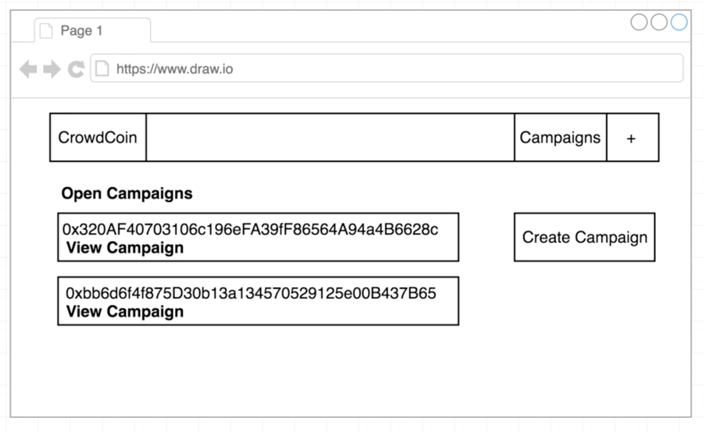
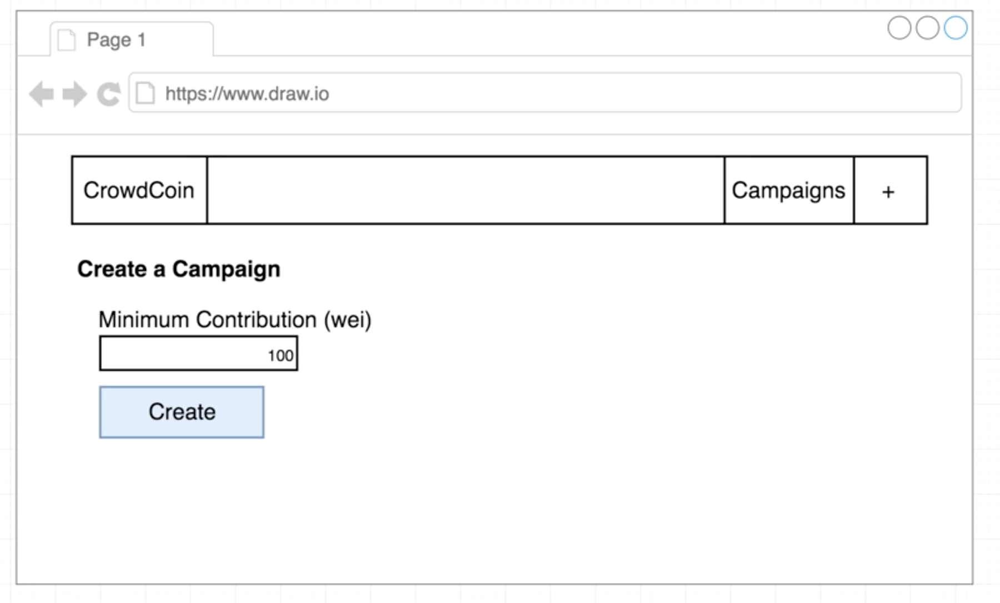
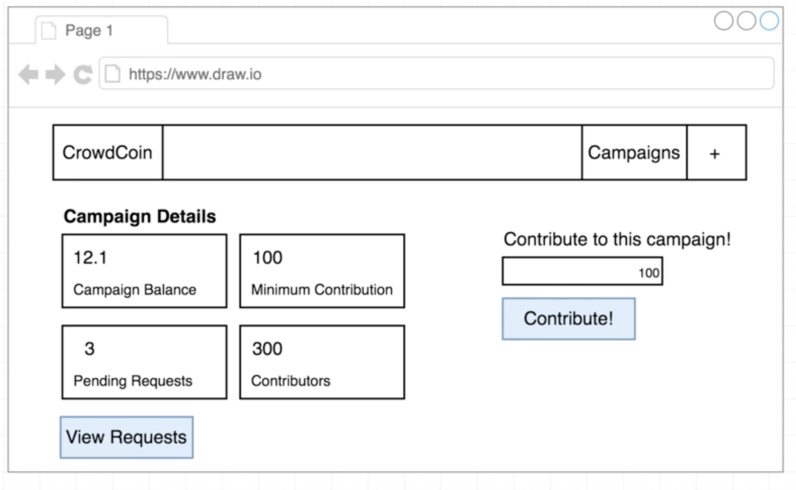
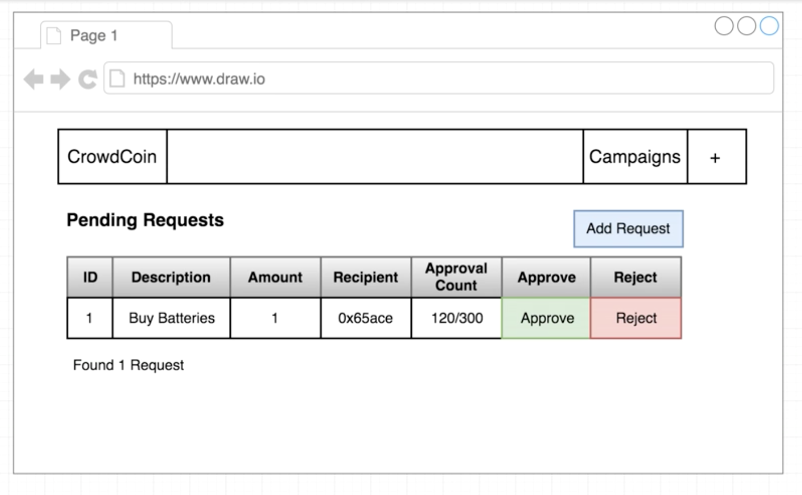
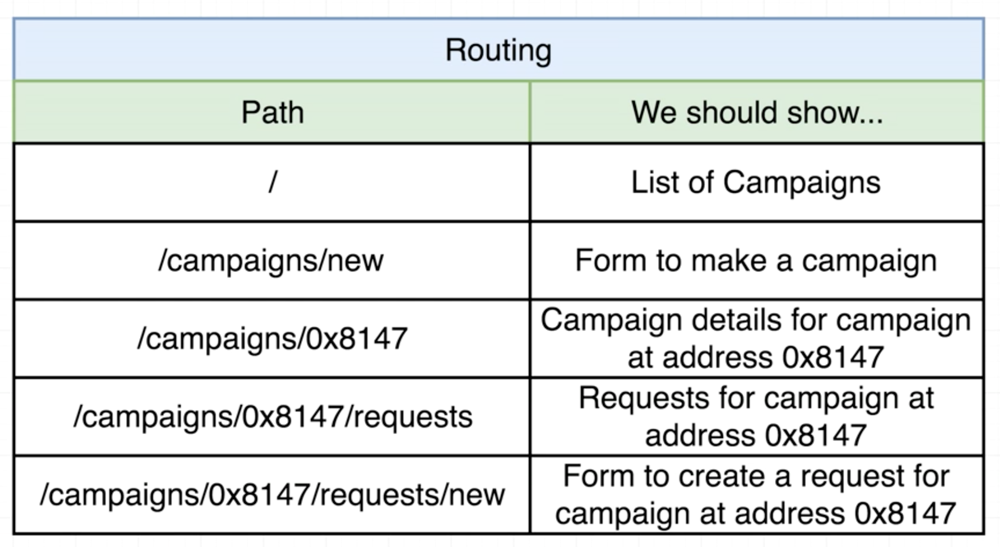

# kickstart

At the end of the day what I am making here is an Ethereum crowdsale clone similar to this one: https://www.ethereum.org/crowdsale

This application allows people to browse open campaigns, contribute to them, create campaigns, create requests, everything I put together inside the contract.

Every aspect of this smart contract has some visible feature in the application I am building.

In the diagram above is the landing page for the application I am working on.

It will end up looking quite nice and you will enjoy the styling of the CSS, but for the mockups I am keeping it in diagram form.

At the top is a header that I am calling CrowdCoin.

At the top I have the name of the application, a link that will take the user to a list of all the different campaigns that have been created and a button that the user can click to create a new campaign as well. This is the landing screen that a user will see when they first visit the application.

The user will see a list of all open campaigns that have ever been created and the user can click on the link to view details about a campaign.

On the right hand side the user can click on create campaign button if the user wants to create a new campaign and you will notice the user can click on a campaign twice, both with the `Create Campaign` button and the `+` symbol, this makes it easier for people to create campaigns.

Once the user decides to create a campaign, the application will redirect them to another screen that uses a form like the one you see below:

There is not a lot of information this application needs from a user when they try to create a campaign.

The application just needs the `Minimum Contribution` amount and the user will enter that into a text input and then click on `Create` button. When the user clicks on the `Create` button, it will run the `createCampaign()` Solidity function on the `CampaignFactory` contract.

The user clicks on `Create` and they wait 15 seconds or so for the actual campaign to be created.

That leads us to the topic of how to handle long pauses as we wait for transactions to be processed.

As this application is built, there are different patterns to investigate to ensure the user is aware that when the `Create` button is clicked, they have to wait for 15 seconds. I must ensure is clear to the user they have to wait while the contract is being processed.

After the user creates the campaign, we must ensure they have the ability to look at details about the campaign:

So the above is a page that shows details about a very particular campaign that has been created.

On the left hand side I want to show statistics on the campaign, balance, amount of money that has to be contributed to be considered an approver, number of requests created and number of people who have contributed to the campaign.

On the right hand side we will show a form that allows the user to contribute some money to the campaign. So the user enters some money and clicks on the `Contribute` button.

On the bottom left-hand side, I will also show a link that someone can click on to be taken to another screen that they can view all the pending requests that are tied to this campaign.

That screen will look like this:

This is going to list all the pending requests for one particular campaign.

I will be putting together a table that shows the **id** of a request, **description**, **amount** of money being transferred, **recipient**, **approval count** and notice how the approval count is going to have both the number of positive votes on the request out of the total number that are tied to the contract.

On the right hand side of the table we will have two buttons that will allow any contributor to either **Approve** or **Finalize** a request. The above diagram has a typo, it should not say Reject, but **Finalize** instead.

Then we want to do some amount of validation when showing these buttons, to only allow a user to finalize a request if the user is a manager and there is an appropriate number of approvals.

The last thing is the `Add Request` button, which if clicked it takes the user to a form where they can attempt to create a brand new request with a description, the amount of money they want to transfer and so on. This form should only be completed by the manager of the campaign because only the manager should be allowed to create spending requests.

#### Routing

Above you have seen this application has about four or five different pages and we need the ability to navigate between each of these pages and more importantly perhaps, I needed to figure out what URL the user will visit to show each of these pages.

Below is a table of some of the possible routes:

These are the routes a user should be able to visit in the application. If the app is registered at crowdcoin.com that will correspond to a path of `/` as **crowdcoin.com/**.

When a user goes to crowdcoin.com/ we show them a list of all the campaigns created. Whenever the user goes to **crowdcoin.com/campaign/new** we should show them the form to create a campaign.

When a user goes to `/campaigns/0x8147...`, the latter representing some address, I am going to assume that the user wants to get some detail about that campaign at that address. So if the user goes to a campaign as outlined, we should attempt to load up the campaign and show details of it to the user.

If the user goes to `/campaigns/0x8147/requests` the user wants to see requests and if the user goes `/campaigns/0x8147/requests/new` the application will present the user with the form where the user can create a new request for that particular campaign.

These are all very separate pages that the user will look at and navigate between and the url will be tightly coupled to what content we want to show the user on the screen.

To review the tech stack used for this application please refer to **wiki** tab.
